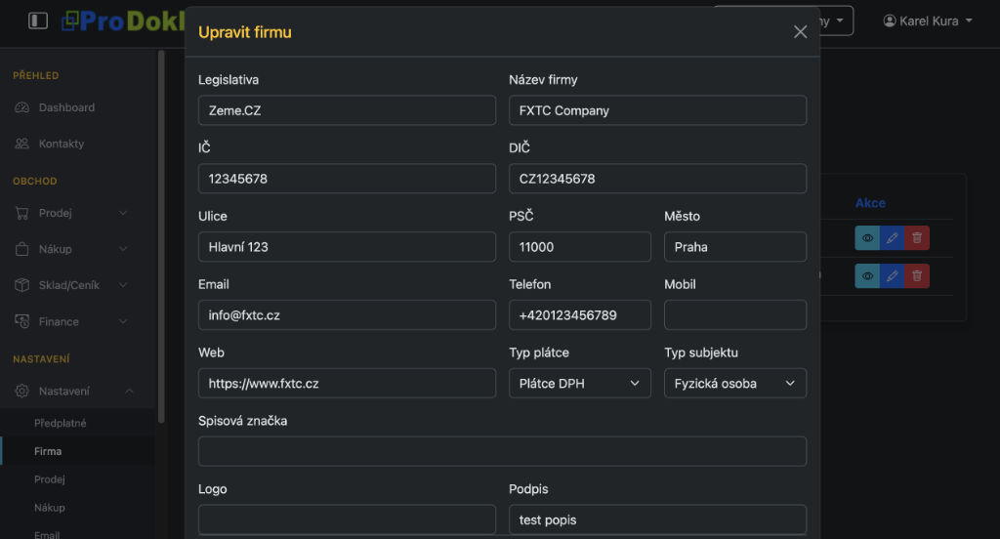
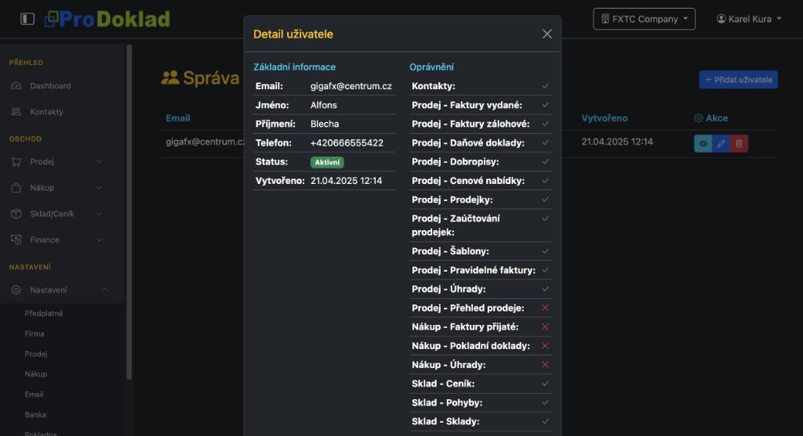
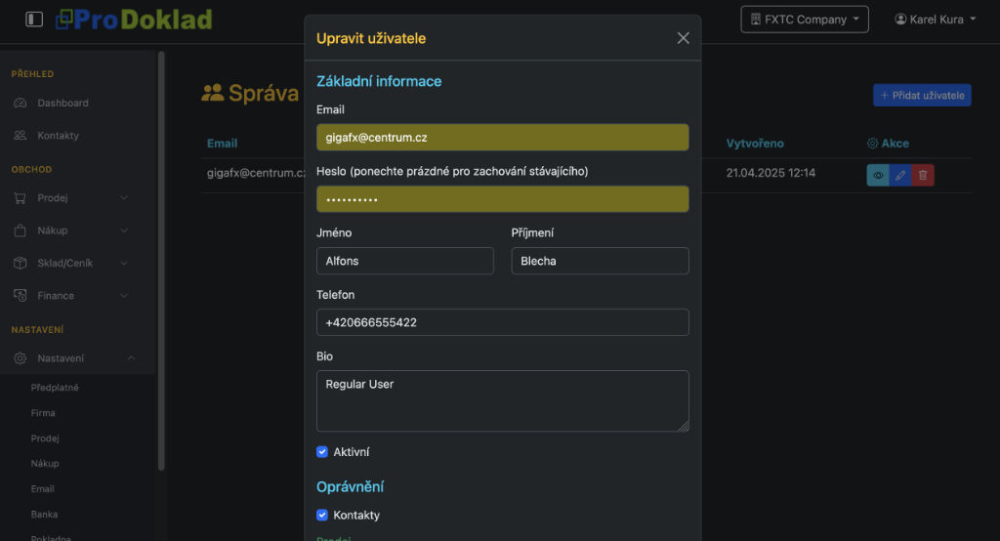

# ProDoklad

Ukázka kódu z aplikace ProDoklad, bez veřejného kódu a způsobu zabezpečení.

V adresáři data/migrations:
se nachází ukázka kodu pro vytvoření databáze a alembic migrací a ukázka kodu pro inicializaci databáze s testovacími daty(po smazání databáze).

V dresáři routers:
je ukázka kodu pro vytvoření endpointu.

V adresáři static: je javascript, css soubory a obrázky.

V adresáři templates se nachází
šablony ninja2, bootstrap pro frontend .

V adresáři models se nachází ukázka kodu pro vytvoření ORM modelu na bázi SQLModel.

Stack:
Součastný základní Fullstack projektu ProDoklad: Python, FastApi, SQLmodel, Jinja2, HTMX, Javascript, HTML, CSS, JWT, OAuth2, SSL, Ollama, AI ML modely, SQLite, PostgreSQL, MariaDB, VPS, VENV, Docker, Portainer, Litespeed ,Uvicorn, Ubuntu 22, Alpine linux.

Aplikace pro správu faktur a dalších dokumentů pro firmy.

Pár ukázek kodu naleznete i na https://github.com/dnatron

Ukázku kodu vytvořil https://www.dnatron.com/

Například registrovaný uživatel si může přidat k vybrané firmě uživatele a nastavit jim prístup do sekcí.

